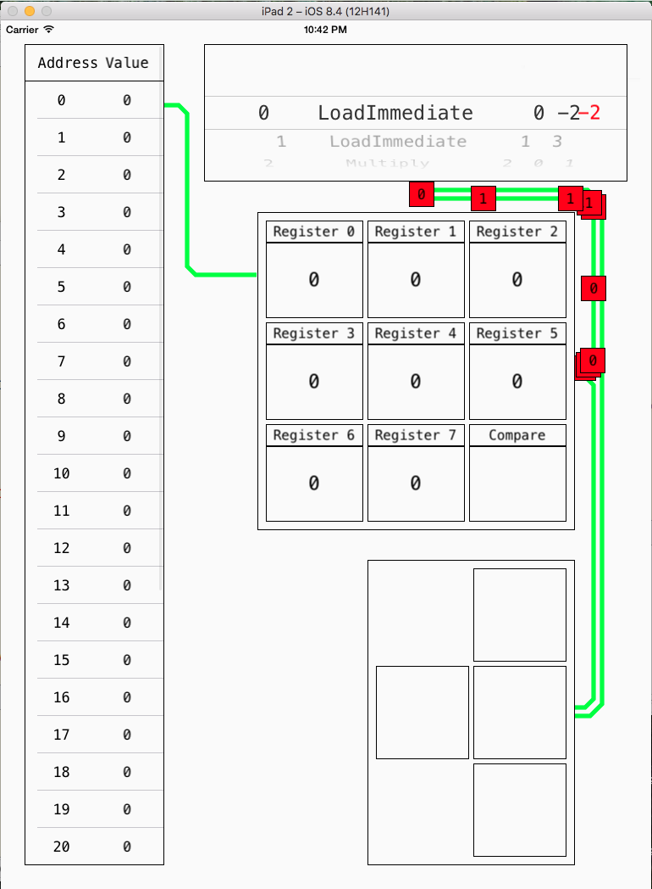

# CPUSimulator

This is an interactive iOS app that simulates how CPU works on a basic level. It is an educational game designed for students from Grade 4 - 12. During the gameplay, students will follow the instructions and place numbers into the correct components. Students will learn about the use of different assembly instructions, the relations between each CPU component, and the logic behind various algorithms.

The app is still under development. The main functionalities are finished. I am currently working on visual effects to make this app more attractive to young students.

Here is a picture on what the app currently looks like: 

